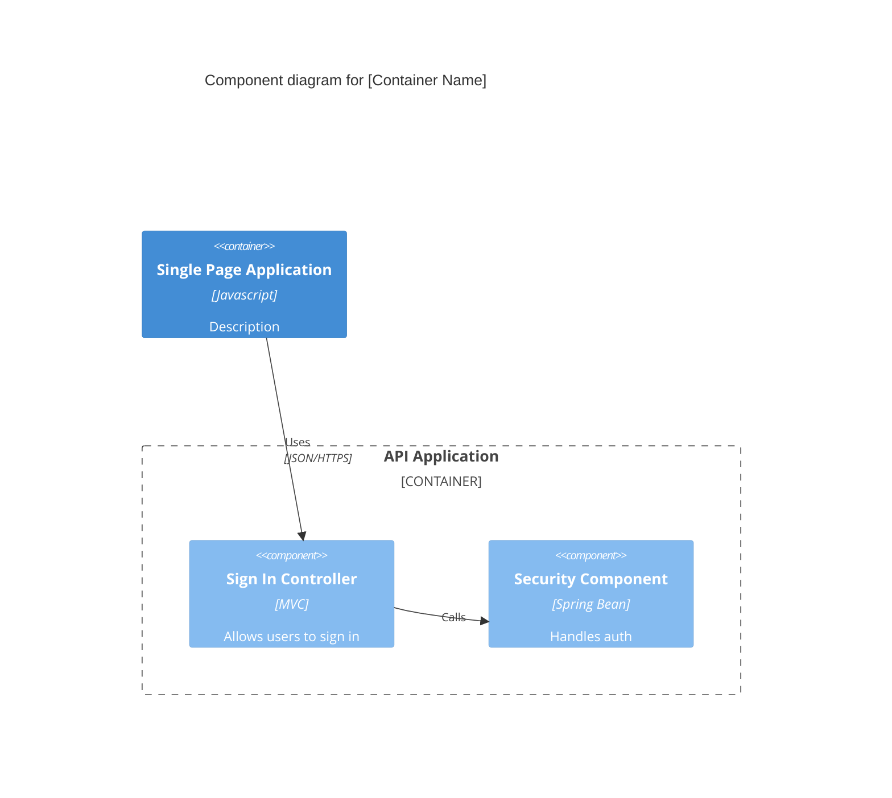

# C4 Component Diagram (C4Component)

The Component diagram zooms into an individual container to show its internal components, their responsibilities, and how they interact.

## Syntax Template

## Key Elements

- `Component(alias, label, ?techn, ?descr, ?sprite, ?tags, $link)`
- `ComponentDb(alias, label, ?techn, ?descr, ?sprite, ?tags, $link)`
- `ComponentQueue(alias, label, ?techn, ?descr, ?sprite, ?tags, $link)`
- `Component_Ext(alias, label, ?techn, ?descr, ?sprite, ?tags, $link)`
- `ComponentDb_Ext(alias, label, ?techn, ?descr, ?sprite, ?tags, $link)`
- `ComponentQueue_Ext(alias, label, ?techn, ?descr, ?sprite, ?tags, $link)`
