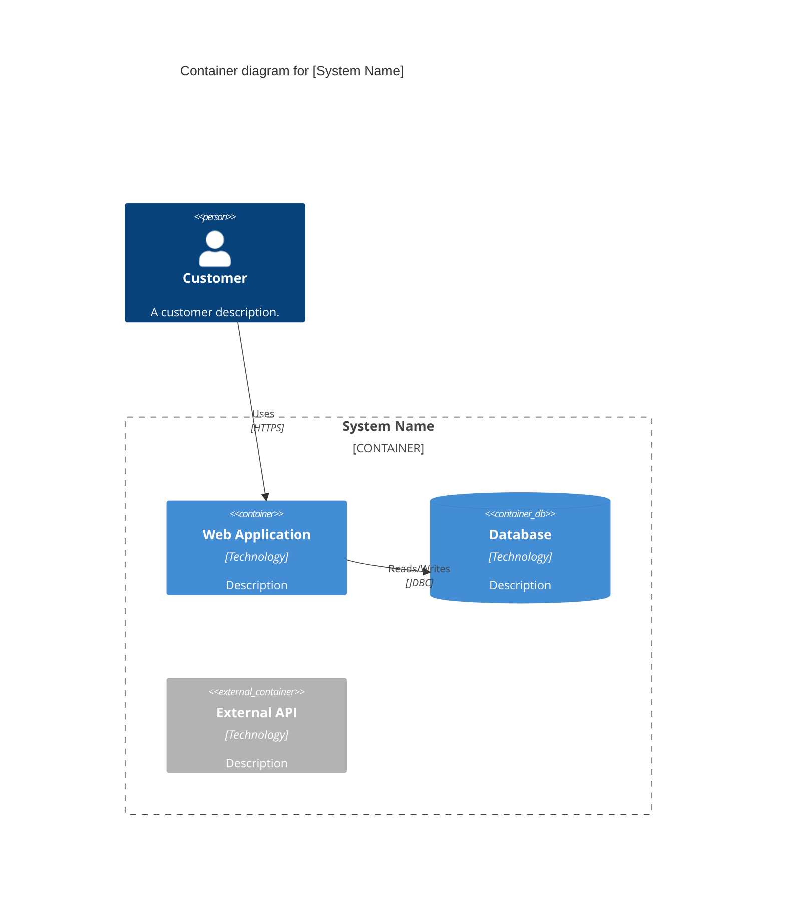

# C4 Container Diagram (C4Container)

The Container diagram zooms into the system, showing the high-level technical building blocks (web apps, databases, microservices) and how they communicate.

## Syntax Template

## Key Elements

- `Container(alias, label, ?techn, ?descr, ?sprite, ?tags, $link)`
- `ContainerDb(alias, label, ?techn, ?descr, ?sprite, ?tags, $link)`
- `ContainerQueue(alias, label, ?techn, ?descr, ?sprite, ?tags, $link)`
- `Container_Ext(alias, label, ?techn, ?descr, ?sprite, ?tags, $link)`
- `ContainerDb_Ext(alias, label, ?techn, ?descr, ?sprite, ?tags, $link)`
- `ContainerQueue_Ext(alias, label, ?techn, ?descr, ?sprite, ?tags, $link)`
- `Container_Boundary(alias, label, ?tags, $link)`
