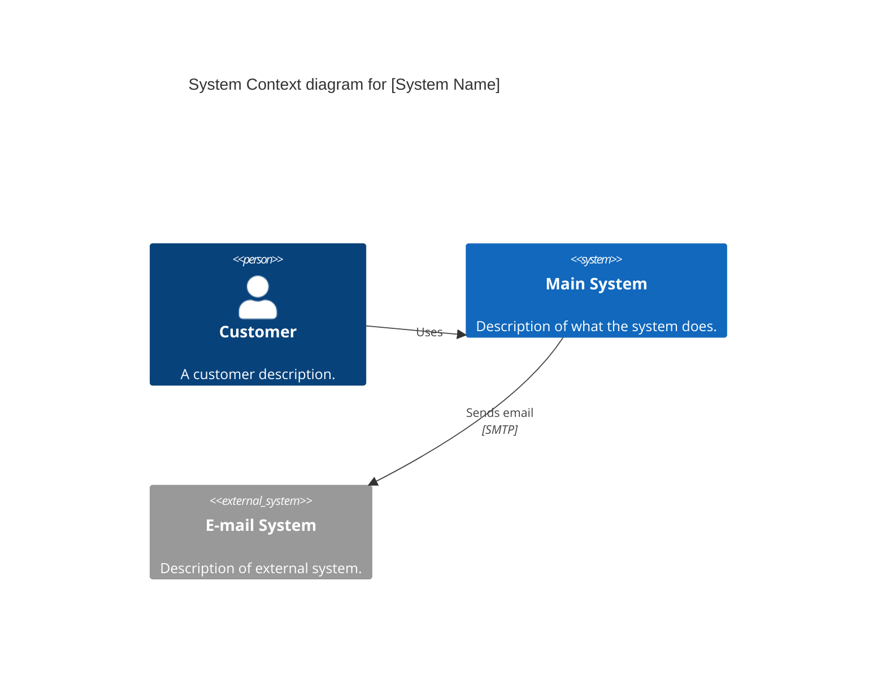

# C4 System Context Diagram (C4Context)

The System Context diagram is the starting point for architecture documentation. It shows the system as a "black box" and its relationships with users and other systems.

## Syntax Template

## Key Elements

- `Person(alias, label, ?descr, ?sprite, ?tags, $link)`
- `Person_Ext(alias, label, ?descr, ?sprite, ?tags, $link)`
- `System(alias, label, ?descr, ?sprite, ?tags, $link)`
- `SystemDb(alias, label, ?descr, ?sprite, ?tags, $link)`
- `SystemQueue(alias, label, ?descr, ?sprite, ?tags, $link)`
- `System_Ext(alias, label, ?descr, ?sprite, ?tags, $link)`
- `SystemDb_Ext(alias, label, ?descr, ?sprite, ?tags, $link)`
- `SystemQueue_Ext(alias, label, ?descr, ?sprite, ?tags, $link)`
- `Boundary(alias, label, ?type, ?tags, $link)`
- `Enterprise_Boundary(alias, label, ?tags, $link)`
- `System_Boundary(alias, label, ?tags, $link)`
