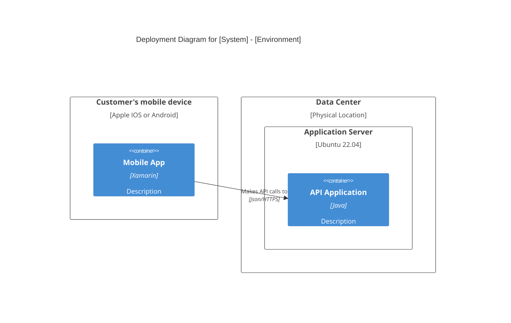

# C4 Deployment Diagram (C4Deployment)

The Deployment diagram shows the mapping of containers onto physical or virtual infrastructure (nodes).

## Syntax Template

## Key Elements

- `Deployment_Node(alias, label, ?type, ?descr, ?sprite, ?tags, $link)`
- `Node(alias, label, ?type, ?descr, ?sprite, ?tags, $link)` (Short name of Deployment_Node)
- `Node_L(alias, label, ?type, ?descr, ?sprite, ?tags, $link)` (Left aligned)
- `Node_R(alias, label, ?type, ?descr, ?sprite, ?tags, $link)` (Right aligned)
