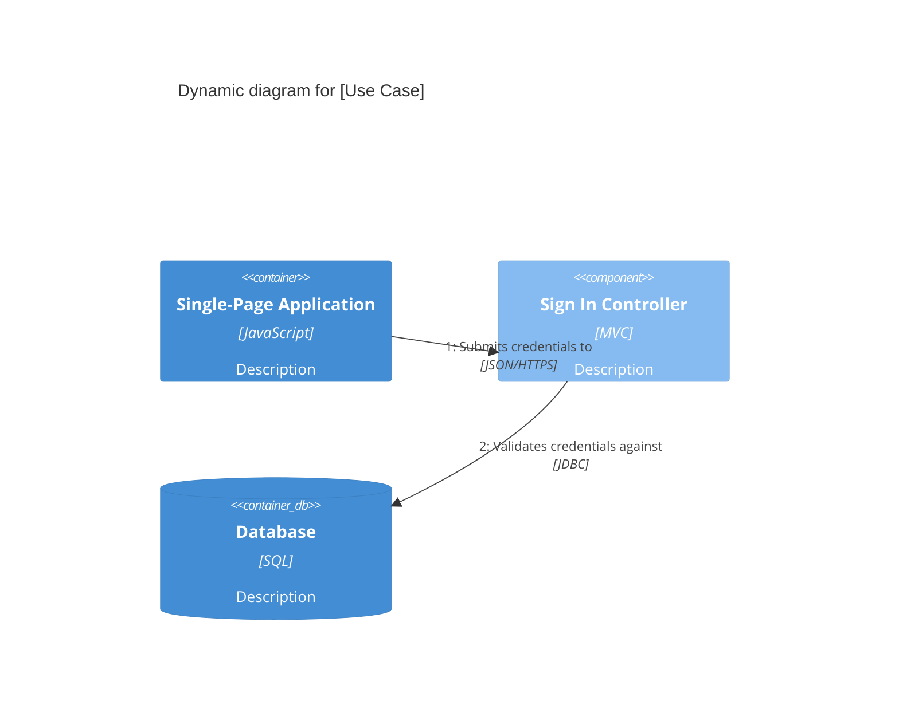

# C4 Dynamic Diagram (C4Dynamic)

The Dynamic diagram shows how the system elements collaborate at runtime to implement a specific use case or flow.

## Syntax Template

## Key Elements

- `RelIndex(index, from, to, label, ?tags, $link)` (Note: Mermaid C4 ignores the index parameter and uses sequential ordering based on statement order).
- Uses standard Rel types.
